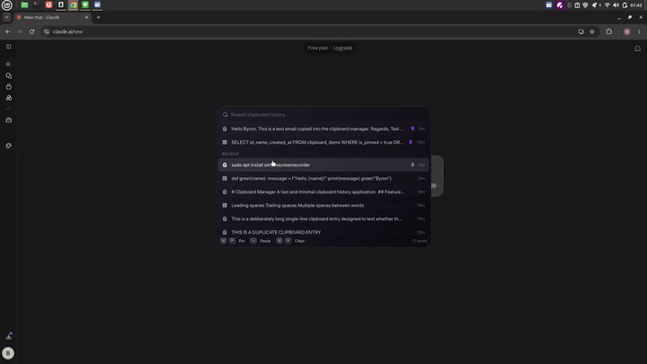

# Superclip

> A clipboard manager you can actually read the source of. Under 1,000 lines, no telemetry, no cloud — just your clipboard, remembered.

Superclip sits quietly in your system tray. Copy things as normal. Hit a hotkey, and your recent clipboard history shows up in a small window. Search, pin, and paste anything you've copied — instantly.

If Superclip saves you a keystroke, give it a star ⭐ — it helps more people find it.



## Install

Download the latest build for your OS from [Releases](https://github.com/anyscapelabs/superclip/releases) and run the installer (Windows `.exe`, macOS `.dmg`, Linux AppImage/DEB/RPM).

**[Install guide →](docs/usage.md)**

## Features

- **Background clipboard watcher** — captures text copies automatically, deduplicated
- **Global hotkey** — `Ctrl+Shift+V` opens the history from any app
- **Instant search** — fuzzy filter across your whole history as you type
- **Paste anywhere** — paste the selected item back into the app you were in
- **Pin favorites** — keep frequently used snippets from scrolling off, pinned above recent history
- **Auto-purge** — history caps at 100 items by default, oldest items drop off
- **Auto-updates** — signed, checked on demand from the tray
- **Runs at login** — starts quietly into the system tray
- **Local-only** — no accounts, no sync, no network calls
- **Cross-platform** — Windows, Linux, and macOS
- **Tiny footprint** — native Tauri app, ~10–15MB, low idle RAM

## Why

Most clipboard managers are either bloated Electron apps or push cloud sync you never wanted. Superclip is built with [Tauri](https://tauri.app): a native app with a ~10–15MB footprint, low idle RAM, and no background telemetry. Everything lives in a single local JSON file and never leaves your machine.

## From source

Requires [Rust](https://www.rust-lang.org/tools/install) and [Bun](https://bun.sh).

```bash
git clone https://github.com/anyscapelabs/superclip.git
cd superclip
bun install
bun run tauri dev      # run in development
bun run tauri build    # produce a release binary
```

## Usage

1. Launch Superclip — it starts quietly in your system tray (and on login).
2. Copy something, anywhere.
3. Press `Ctrl+Shift+V` to open your history.
4. Start typing to search; use arrows to navigate, Enter to paste.
5. Hover an item and click the pin to keep it forever.
6. Right-click the tray icon to open Superclip, check for updates, or quit.

**[Full usage guide →](docs/usage.md)**

## How it works

- A background thread polls the OS clipboard every ~500ms using [`arboard`](https://crates.io/crates/arboard) and hashes each entry to detect changes.
- New entries are appended to a JSON history file in the app's local data directory.
- Paste focuses the window you were in and synthesizes `Ctrl+V` (via `xdotool` on Linux, SendKeys on Windows, System Events on macOS) with focus verification and retry.
- Text vs code is detected heuristically in the backend.
- The frontend is plain React + Tailwind talking to the Rust backend through Tauri's command API.
- A global shortcut (via `tauri-plugin-global-shortcut`) toggles the window without needing focus.

**[Architecture →](docs/architecture.md)**

## Roadmap

- [x] Clipboard history with search and pinning
- [x] Reliable paste into the app you came from
- [x] Signed auto-updates
- [x] Auto-start into the tray
- [ ] Image clipboard support (screenshots, copied images)
- [ ] Optional encryption at rest for sensitive entries
- [ ] Per-item expiry (auto-delete after N minutes)
- [ ] Terminal paste (X11 PRIMARY / middle-click)
- [ ] Configurable hotkey

## Privacy

Superclip never sends data anywhere. There is no analytics, no cloud sync. Your clipboard history lives in a single local file you can open, inspect, or delete at any time. The only network call is the optional auto-update check.

## Contributing

Pull requests are welcome. For anything beyond a small fix, please open an issue first to discuss the change. Keep additions consistent with the project's goal: small, readable, and dependency-light.

**[Contributing guide →](docs/CONTRIBUTING.md)**

## License

[MIT](LICENSE)

## Changelog

See [CHANGELOG.md](CHANGELOG.md).
